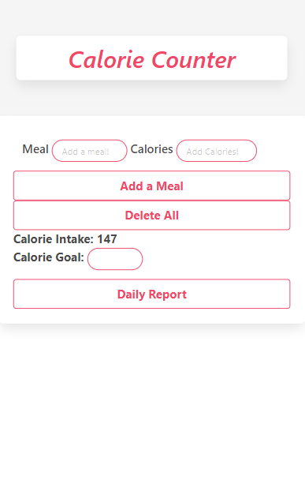
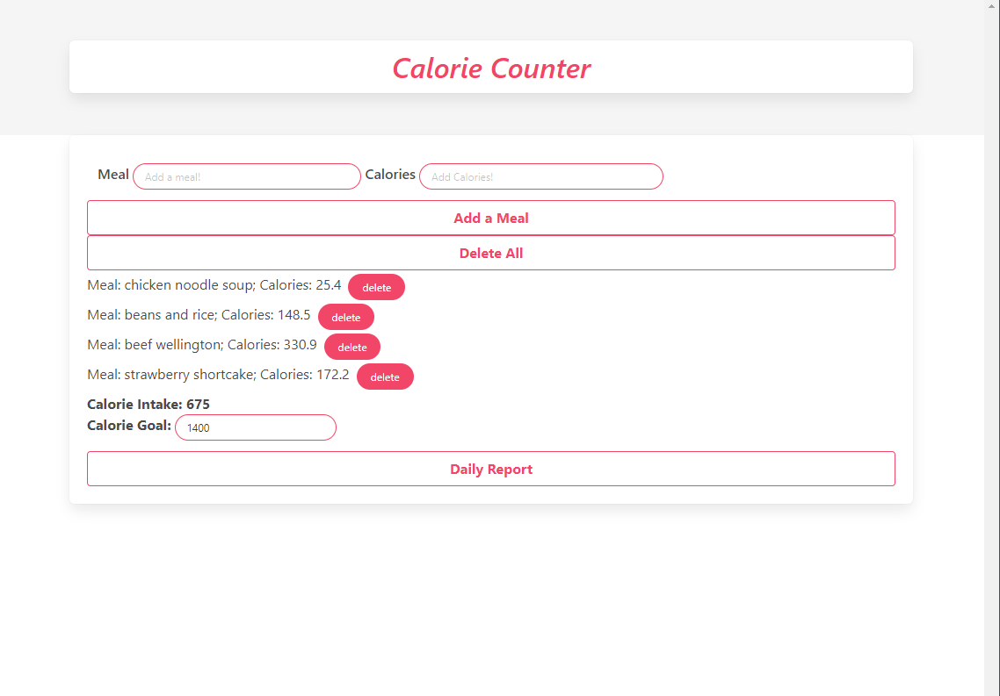
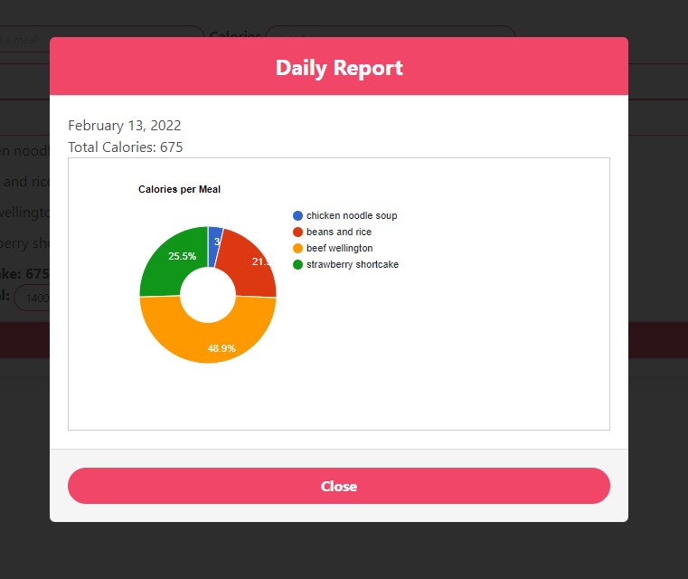

# Calorie Counter 

# Description

We designed an app to help record and collect the user's daily intake. 
Not just that, but we also offer a calorie goal feature to help improve user's health.

# Concept: 
An app that logs the daily calorie intake of the user.

Our drive for this project was to create an app to assist with maintiaing a healthier lifestyle

## Features

- Manually enter your calories or pull your calories auto matically.
- Set a calorie goal
- Track your calories on a daily basis
- Have an in depth graph to show you the percentages of each calorie meal. 
- Mobile friendly 

## Demo

https://mickieburch.github.io/Calorie-counter/

## Tech Stack

**Clients used:** 
- Bulma API, 
- Calorie Ninja API, 
- Google Charts API, 
- jQuery API

## Screenshots
Mobile First Design 
 

Dynamic Meal Tracking 
 

Daily Reports With Google Charts 
 